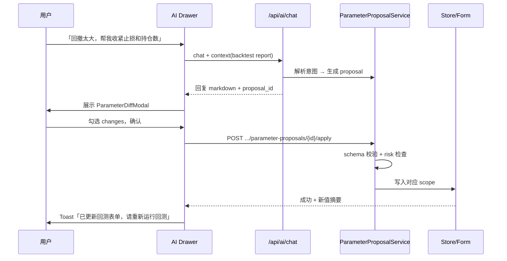

# AI 助手升级计划

更新时间：2026-06-02  
状态：**已评审 — 按下列决策实施**  
目标：让用户在任意页面基于**程序运行结果**和**内置交易/回测方法论**随时向 AI 提问，并在确认后由 AI 辅助调整参数。

---

## 0. 已确认决策（2026-06-02）

| # | 问题 | 决策 |
|---|---|---|
| 1 | 流式回复 | ✅ **做**，放在 **Phase 3** |
| 2 | 会话持久化 | ✅ **做**，放在 **Phase 3** |
| 3 | 用户自定义 Playbook（个人交易原则） | ✅ **允许**，设置页编辑，合并进 System Prompt |
| 4 | 快捷提问自定义模板 | ✅ **支持**，按页面保存，可增删改 |
| 5 | AI 辅助设置参数 | ✅ **做**，**Phase 4**；必须「建议 → 预览 diff → 用户确认 → 写入」，禁止静默改参 |

---

## 1. 背景与目标

### 1.1 现状

| 能力 | 状态 |
|---|---|
| 单股结构化 AI 分析（起爆日/题材/原因） | ✅ 已有 `POST /api/stocks/{symbol}/ai-analyze` |
| Prompt 上下文（K 线、资讯、选股指标） | ✅ `_compose_ai_prompt_context` |
| 多轮对话 | ❌ 无 |
| 全局 AI 入口 | ❌ 仅 K 线页 + `/ai` 历史列表 |
| 回测/选股方法论注入 | ❌ 无 |
| 按当前页面带入运行快照 | ❌ 无 |
| Token/调用统计 | ❌ 无 |
| `core/ai_analyzer.py` | ⚠️ 已编写但未接入，逻辑在 `store.py` |

### 1.2 升级目标（Must Have）

1. **上下文问答**：用户在看选股结果、回测报告、K 线、策略对比时，可针对**当前屏幕数据**提问。
2. **方法论一致**：AI 回答必须基于程序内置规则（选股 Step1–4、Wyckoff 事件、策略插件、回测引擎参数），不编造未提供的数据。
3. **回测思路注入**：各策略设计意图、入场/出场规则、回测执行逻辑以 **AI Playbook** 形式持久供给 System Prompt。
4. **向后兼容**：保留现有 `ai-analyze` 结构化分析；新能力以独立 `/api/ai/chat` 提供。
5. **AI 辅助设参（Phase 4）**：基于回测/选股结果建议参数变更，**用户确认后**才写入表单或配置。

### 1.3 非目标（Out of Scope）

- AI **静默**改参数或自动触发回测（须用户确认后才应用）
- 替代回测引擎做买卖决策
- 多用户/云端会话同步
- RAG 向量库（首版用结构化 JSON + 摘要即可）

---

## 2. 总体架构

```
┌─────────────────────────────────────────────────────────────┐
│  Frontend                                                    │
│  ┌──────────────┐  ┌─────────────────┐  ┌─────────────────┐ │
│  │ PageContext  │→ │ AIAssistantPanel│→ │ QuickPrompts    │ │
│  │ Provider     │  │ (Drawer/Chat)   │  │ (按页面预设)     │ │
│  └──────────────┘  └─────────────────┘  └─────────────────┘ │
└────────────────────────────┬────────────────────────────────┘
                             │ POST /api/ai/chat
                             ▼
┌─────────────────────────────────────────────────────────────┐
│  Backend                                                     │
│  ┌──────────────┐  ┌─────────────────┐  ┌─────────────────┐ │
│  │ AIPlaybook   │  │ ContextBuilder  │  │ ChatService     │ │
│  │ (方法论)      │+ │ (页面快照摘要)   │→ │ (多轮+Provider) │ │
│  └──────────────┘  └─────────────────┘  └─────────────────┘ │
│         ▲                    ▲                               │
│  StrategyRegistry     store / 各模块摘要函数                   │
│  docs 策略框架         screener / backtest / signals         │
└─────────────────────────────────────────────────────────────┘
```

### 2.1 Prompt 三层结构

| 层 | 名称 | 内容 | 大小预算 |
|---|---|---|---|
| L1 | **Playbook** | 选股漏斗、Wyckoff 事件、策略说明、回测规则 | ~2–4k tokens（固定精简版） |
| L2 | **Runtime Snapshot** | 当前页面 run_id、参数、结果摘要、焦点股票 | ~1–3k tokens（动态） |
| L3 | **Conversation** | 用户消息 + 最近 N 轮历史 | ~2–4k tokens |

System Prompt 模板（示意）：

```
你是 Final Trade 内置分析助手。
规则：
1. 只依据 [PLAYBOOK] 与 [RUNTIME] 回答；缺失则明确说「上下文中无此数据」。
2. 不给出具体买卖建议；只解释程序逻辑、结果含义、参数影响。
3. 区分「量化置信度 ai_confidence（本地公式）」与「LLM 分析结论」。

[PLAYBOOK]
{playbook_json}

[RUNTIME]
page={page}
title={title}
snapshot={snapshot_json}
```

---

## 3. AI Playbook（方法论层）

### 3.1 数据源与生成方式

| 模块 | 代码/文档来源 | Playbook 字段 |
|---|---|---|
| 选股四层 | `store.py` trend_pool + `docs/策略框架_现状梳理_2026-02-23.md` | `screener.funnel.step1~4` |
| Wyckoff 事件 | `signal_analyzer.py` + 策略框架文档 §4 | `wyckoff.events.*` |
| 策略列表 | `strategy_registry.py` | `strategies.{id}.intent, entry, exit, params_hint` |
| 回测引擎 | `backtest_engine.py`, `BacktestRunRequest` | `backtest.execution.*` |
| B1 / 趋势王等 | `b1_strategy.py`, `trend_king_strategy.py` | 各策略 `intent` 段落 |

### 3.2 代码改造（Playbook 可维护性）

**Phase 0 前置**：为 `StrategyDescriptor` 增加字段：

```python
@dataclass(frozen=True)
class StrategyDescriptor:
    ...
    description: str = ""      # 1–3 句策略意图（给人和 AI）
    playbook: dict[str, Any] = field(default_factory=dict)  # 结构化规则摘要
```

新增 `backend/app/core/ai_playbook.py`：

- `build_playbook() -> dict`：聚合 registry + 静态规则
- `build_playbook_text(compact=True) -> str`：供 Prompt 使用
- 单元测试：确保每个 `enabled` 策略都有 `description`

**同步策略**：Playbook 从代码生成，docs 仅作人工参考，避免文档与实现脱节。

### 3.2.1 用户自定义 Playbook（个人交易原则）

**存储**：`~/.tdx-trend/ai_playbook.local.json`

```json
{
  "principles": [
    "只做主板，回避 ST",
    "单笔止损不超过 5%，宁可少做",
    "偏好 Spring/LPS 入场，少追 UTAD 后段"
  ],
  "updated_at": "2026-06-02T12:00:00"
}
```

**设置页**：新增「AI → 个人交易原则」文本区（多条 bullet，或 Markdown 短段落）。

**合并规则**：

```python
def build_playbook(..., include_user=True):
    base = build_system_playbook()
    if include_user:
        base["user_principles"] = load_local_playbook().principles
    return base
```

**Prompt 位置**：System Prompt 末尾 `[USER_PRINCIPLES]`，并声明「解释与设参建议时优先考虑用户原则，但不得违反程序硬约束（如 params_schema 上下界）」。

**API**：

| 方法 | 路径 | 说明 |
|---|---|---|
| GET | `/api/ai/playbook/local` | 读取用户原则 |
| PUT | `/api/ai/playbook/local` | 保存用户原则 |

### 3.3 Playbook 体积控制

- 全量 Playbook 缓存于内存，按 `context.scope` 裁剪：
  - `chart` / 单股：screener 规则 + wyckoff + 当前策略（若有）
  - `backtest`：回测规则 + 当前 `strategy_id` 完整说明
  - `screener`：screener 四层 + 当前 run 参数
  - `strategy_compare`：涉及的多策略说明
- 单策略 `playbook` 不超过 ~400 字；Wyckoff 事件表用「名称 + 一句话触发条件」。

---

## 4. 页面上下文（Runtime Snapshot）

### 4.1 统一类型

**Backend** — `models.py`：

```python
class AIChatContext(BaseModel):
    page: Literal["chart", "screener", "signals", "backtest", "strategy", "review", "generic"]
    title: str
    as_of_date: str | None = None
    symbol: str | None = None
    refs: dict[str, str] = {}          # run_id, report_id, task_id ...
    payload: dict[str, Any] = {}       # 页面提交的摘要（前端或后端二次 enrich）

class AIChatRequest(BaseModel):
    session_id: str | None = None
    messages: list[AIChatMessage]
    context: AIChatContext
    stream: bool = False

class AIChatResponse(BaseModel):
    session_id: str
    message: AIChatMessage
    usage: AIChatUsage | None = None
    citations: list[str] = []          # 引用的 playbook 章节 / 数据字段
```

**Frontend** — `types/contracts.ts` 镜像上述类型。

### 4.2 各页面 Context 规范

| 页面 | `page` | `refs` | `payload` 最小字段 |
|---|---|---|---|
| K 线 | `chart` | — | symbol, screener_row?, wyckoff_snapshot?, latest_ai_record?, annotation? |
| 选股漏斗 | `screener` | run_id | as_of_date, step_configs, step_counts, focus_symbol?, reject_reasons? |
| 待买信号 | `signals` | run_id, strategy_id | signal_list_top20, params, filtered_count |
| 回测 | `backtest` | report_id / task_id | strategy_id, date_range, params, summary_metrics, worst_trades_top5 |
| 策略中心 | `strategy` | strategy_id | descriptor, current_params, compare_ids? |
| 策略对比 | `strategy` | — | strategy_ids, metric_table_summary |
| 复盘 | `review` | date | daily_review, tag_stats_summary |

### 4.3 后端 Enrich（推荐）

前端传 `refs` + 最小 `payload`，后端 `AIContextBuilder.enrich(context)` 从 `store` 拉完整摘要，避免前端重复业务逻辑、减少篡改风险。

示例：

```python
def enrich_screener_context(ctx: AIChatContext) -> AIChatContext:
    run_id = ctx.refs.get("run_id")
    detail = store.get_screener_run(run_id)
    ctx.payload["steps"] = summarize_screener_steps(detail)
    if ctx.symbol:
        ctx.payload["focus"] = find_row_with_reject_reason(detail, ctx.symbol)
    return ctx
```

---

## 5. API 设计

### 5.1 新增端点

| 方法 | 路径 | 说明 |
|---|---|---|
| POST | `/api/ai/chat` | 多轮对话（可选 SSE `stream=true`） |
| GET | `/api/ai/playbook` | 返回当前 Playbook JSON（调试/设置页预览） |
| GET | `/api/ai/sessions/{id}` | 获取会话历史（可选，Phase 3） |
| DELETE | `/api/ai/sessions/{id}` | 清除会话 |
| GET | `/api/ai/playbook/local` | 用户个人交易原则 |
| PUT | `/api/ai/playbook/local` | 保存个人交易原则 |
| GET | `/api/ai/quick-prompts` | 快捷提问模板列表 |
| PUT | `/api/ai/quick-prompts` | 保存快捷提问模板 |
| POST | `/api/ai/parameter-proposals` | AI 生成参数变更建议（仅返回 proposal，不写入） |
| POST | `/api/ai/parameter-proposals/{id}/apply` | 用户确认后应用（见 §16） |

保留不变：

- `POST /api/stocks/{symbol}/ai-analyze`
- `GET /api/ai/records`
- `POST /api/ai/providers/test`

### 5.2 Chat 调用链

```
AIChatService.chat(request)
  → resolve_provider / api_key
  → playbook = AIPlaybook.build(scope=request.context.page, strategy_id=...)
  → context = AIContextBuilder.enrich(request.context)
  → messages = compose_messages(system, playbook, context, history)
  → httpx POST .../chat/completions  (temperature=0.2)
  → persist session (optional)
  → return markdown reply
```

### 5.3 流式输出（Phase 3）

- `stream=true` 时返回 `text/event-stream`
- 前端 Drawer 逐字渲染；首版可同步 JSON 降低复杂度

### 5.4 失败与回退

| 错误 | 行为 |
|---|---|
| 无 API Key | 422 + `AI_KEY_MISSING` |
| 超时 | 基于 Playbook + Runtime 的**本地模板回答**（如「Step4 过滤条件为…」） |
| Provider 错误 | 同上 + 提示检查设置 |

---

## 6. 前端改造

### 6.1 新组件

| 组件 | 路径 | 职责 |
|---|---|---|
| `AIAssistantProvider` | `frontend/src/state/aiAssistantStore.ts` | 会话 id、消息列表、打开/关闭 |
| `PageAIContextProvider` | `frontend/src/shared/ai/PageAIContext.tsx` | 各页注册 context |
| `AIAssistantDrawer` | `frontend/src/shared/components/AIAssistantDrawer.tsx` | 聊天 UI + 快捷提问 |
| `usePageAIContext` | hook | 子页面更新 snapshot |

### 6.2 全局入口

- 在 `AppShell`  Header 增加「AI 助手」按钮（`RobotOutlined` 或类似）
- Drawer 宽度 ~400px，不遮挡主图表操作区
- 展示当前 context `title`（如「回测：维科夫趋势V2 2024」）

### 6.3 快捷提问（内置 + 用户自定义）

**内置模板（按页面，不可删可隐藏）** — 示例：

| 页面 | 内置快捷问 |
|---|---|
| K 线 | 结构符合哪条策略？ / 起爆日如何判定？ / Step4 会被哪条规则拦？ |
| 选股 | Step3→4 差异？ / 为什么 {symbol} 没进池？ / 今日 pool 特征？ |
| 回测 | 回撤原因？ / 相对默认改了什么？ / 哪些月份拖累？ |
| 策略 | 设计意图？ / 入场出场事件含义？ |
| 设参 | 根据这次回测，建议怎么调 stop_loss？ / 帮我收紧 Step4 条件 |

**用户自定义模板（Phase 2 起）**

**存储**：`~/.tdx-trend/ai_quick_prompts.json`

```json
{
  "templates": [
    {
      "id": "uuid",
      "page": "backtest",
      "label": "按我的稳健风格调参",
      "prompt": "结合 [USER_PRINCIPLES] 和当前回测结果，给出 3 个参数调整建议并说明理由",
      "pinned": true
    }
  ]
}
```

**UI**：

- Drawer 顶部：内置 + 自定义 chips，点击即发送
- 设置页「AI → 快捷提问」：按 page 分组，增删改、排序、置顶
- 支持占位符：`{symbol}` `{strategy_id}` `{run_id}` — 发送前由前端替换

### 6.4 与现有 AI 分析的关系

- K 线页保留「AI 分析本股」→ 结构化 JSON 结果
- 结构化结果自动写入 `PageAIContext.payload.latest_ai_record`
- Drawer 中可「基于刚才的分析继续问」

---

## 7. 现有能力修补（并行小项）

与主计划并行、低成本高收益：

| 项 | 说明 | 文件 |
|---|---|---|
| 结论枚举约束 | `conclusion` 强制映射到 `发酵中/高潮/退潮/Unknown` | `store._call_provider_for_stock` |
| 实现 `ai_retry_count` | 调用 Provider 时重试 | `store._call_provider_for_stock` |
| 重命名 UI 文案 | `ai_confidence` →「结构置信度」 | `ScreenerPage`, `compareView` |
| 接入或删除 `ai_analyzer.py` | 统一到 `AIChatService` / 删除 dead code | `core/ai_analyzer.py` |
| Prompt 预览 UI | 设置页「AI 调试」展示 playbook + 样例 prompt | `SettingsPage` |

---

## 8. 持久化与会话

| 数据 | 存储 | 保留策略 |
|---|---|---|
| 结构化 AI 分析 | `app_state.json` → `ai_records` | 现有 200 条上限 |
| 对话会话 | `~/.tdx-trend/ai_sessions/{session_id}.json` | 每会话最多 50 轮；30 天过期 |
| Token 用量 | 会话文件内累计 `usage` | 设置页展示本月估算 |

首版会话可**仅内存 + 刷新丢失**，Phase 3 再持久化。

---

## 9. 分阶段实施计划

### Phase 0 — 基础整理（2–3 天）

**交付**

- [ ] `StrategyDescriptor.description` + 各内置策略填 intent
- [ ] `ai_playbook.py` + `GET /api/ai/playbook`
- [ ] 修复 `conclusion` 枚举、`ai_retry_count`
- [ ] 单测：`build_playbook()` 快照测试

**验收**：Playbook API 返回完整策略说明；现有 ai-analyze 结论格式稳定。

---

### Phase 1 — K 线页追问 MVP（3–4 天）

**交付**

- [ ] `POST /api/ai/chat`（非流式）
- [ ] `AIChatService` + `AIContextBuilder.enrich_chart`
- [ ] K 线页：分析结果下方「继续提问」或打开 Drawer
- [ ] Playbook 注入 screener + wyckoff + 单股 snapshot

**验收**：用户在 K 线页问「为什么判定这个起爆日」，回答引用 playbook 中的量价规则且与页面数据一致。

---

### Phase 2 — 全局助手 + 选股/回测上下文（5–7 天）

**交付**

- [ ] `AIAssistantDrawer` + `AppShell` 全局入口
- [ ] `PageAIContextProvider` 接入：选股、回测、策略中心
- [ ] `enrich_screener` / `enrich_backtest` / `enrich_strategy`
- [ ] 各页内置快捷提问 + **用户自定义快捷提问 CRUD**
- [ ] `GET/PUT /api/ai/quick-prompts`
- [ ] **`GET/PUT /api/ai/playbook/local`（个人交易原则）**
- [ ] 后端 context 摘要函数（控制 token）

**验收**：在回测报告页问「回撤原因」能结合 report 摘要 + 策略 playbook + 用户原则回答；自定义快捷问可保存并在 Drawer 一键发送。

---

### Phase 3 — 体验与运维（3–5 天）

**交付**

- [ ] **SSE 流式回复**（`stream=true`）
- [ ] **会话持久化** + 历史列表（`~/.tdx-trend/ai_sessions/`）
- [ ] 设置页：Playbook 预览、个人原则编辑、快捷问管理、用量统计、AI 调试
- [ ] 信号页、复盘页、策略对比页 context
- [ ] E2E：打开回测 → 提问 → 断言回复含关键指标

**验收**：长回答流式显示；刷新后会话可恢复；设置页可见本月调用次数与个人原则生效。

---

### Phase 4 — AI 辅助设参（5–7 天）

**交付**

- [ ] `AIParameterProposalService` + 参数 schema 校验
- [ ] `POST /api/ai/parameter-proposals` + `.../apply`
- [ ] 前端 **ParameterDiffModal**（变更预览、逐项勾选、确认应用）
- [ ] 支持设参范围（见 §16.2）
- [ ] Chat 工具模式：用户说「帮我把止损调到 4%」→ 返回 proposal 卡片而非直接改

**验收**：AI 建议的参数通过 schema 校验；用户取消则不写入；应用后回测页表单/策略参数可见更新。

---

### Phase 5 — 可选增强（后续）

- 「让 AI 对比两次回测」专用 context 模板
- 导出对话为复盘笔记（写入 review）
- 按问题类型路由不同 temperature / model
- 设参后「一键重新回测」快捷动作（仍须用户点击确认）

---

## 10. 文件改动清单（预估）

### Backend 新增

```
backend/app/core/ai_playbook.py
backend/app/core/ai_chat_service.py
backend/app/core/ai_context_builder.py
backend/app/core/ai_parameter_proposal.py   # Phase 4
backend/tests/test_ai_playbook.py
backend/tests/test_ai_chat_api.py
backend/tests/test_ai_parameter_proposal.py # Phase 4
```

### Backend 修改

```
backend/app/models.py              # AIChat* 模型
backend/app/main.py                # 新路由
backend/app/store.py               # enrich 委托、薄封装
backend/app/core/strategy_registry.py  # description / playbook
```

### Frontend 新增

```
frontend/src/state/aiAssistantStore.ts
frontend/src/shared/ai/PageAIContext.tsx
frontend/src/shared/components/AIAssistantDrawer.tsx
frontend/src/shared/api/aiChat.ts
frontend/src/shared/components/ParameterDiffModal.tsx  # Phase 4
```

### Frontend 修改

```
frontend/src/shared/components/AppShell.tsx
frontend/src/pages/chart/ChartPage.tsx
frontend/src/pages/screener/ScreenerPage.tsx
frontend/src/pages/backtest/BacktestPage.tsx
frontend/src/pages/strategy/StrategyCenterPage.tsx
frontend/src/types/contracts.ts
frontend/src/shared/api/endpoints.ts
```

---

## 11. 风险与对策

| 风险 | 对策 |
|---|---|
| Prompt 超 Token | 摘要函数 + scope 裁剪 Playbook；限制 history 轮数 |
| 文档与代码不一致 | Playbook 从 registry/代码生成，docs 不直接注入 |
| AI 幻觉 | System 强制「无数据则声明」；citations 列出引用字段 |
| 成本不可控 | 会话 rate limit（如 20 次/小时）；设置页用量展示 |
| `store.py` 过大 | 新逻辑放 `ai_chat_service.py`，store 只做委托 |
| AI 乱改参数 | 仅 output proposal；schema 校验；apply 须显式确认；危险项二次确认 |
| 用户原则与硬约束冲突 | 校验失败时拒绝 apply 并返回原因 |

---

## 12. 验收标准（总）

1. 任意已接入页面可打开 AI 助手并看到当前 context 标题。
2. 提问「为什么某股被 StepX 过滤」时，回答与程序 reject_reason 一致。
3. 提问「某策略入场逻辑」时，回答与 StrategyRegistry description 一致。
4. 提问「回测回撤」时，回答引用 report 中的 max_drawdown 日期/数值。
5. 现有 `ai-analyze` 行为不退化；无 Key 时有明确错误提示。
6. 单测覆盖 playbook 生成、chat API 401/422、context enrich。
7. （Phase 4）AI 设参 proposal 校验通过且未经确认不会写入任何配置。

---

## 13. 时间估算（更新）

| 阶段 | 工期 | 累计 |
|---|---|---|
| Phase 0 | 2–3 天 | 3 天 |
| Phase 1 | 3–4 天 | 7 天 |
| Phase 2 | 5–7 天 | 14 天 |
| Phase 3 | 3–5 天 | 19 天 |
| Phase 4 | 5–7 天 | **26 天** |

**约 4–5 周**（单人全职当量）；Phase 0+1 约 1 周可出问答 MVP；**设参能力在第 4–5 周**。

---

## 14. 下一步行动

1. ~~评审决策~~ 已确认（见 §0）。
2. 从 **Phase 0** 开始：StrategyRegistry 补 `description` + `ai_playbook.py`。
3. 并行修 `conclusion` 枚举等小项。
4. Phase 1 → 2 → 3 按序交付问答与流式；**Phase 4 专门做设参**。

---

## 15. （原 §13 已关闭）

评审问题已全部确认，见 **§0 已确认决策**。

---

## 16. AI 辅助设参（Phase 4 详设）

### 16.1 设计原则

1. **AI 只建议，不执行**：对话里返回 `parameter_proposal` 结构化块，前端渲染为可操作的「变更卡片」。
2. **用户必须确认**：勾选要应用的项 → 点「应用到表单 / 保存到配置」→ 调 `apply` API。
3. **Schema 校验为准**：以 `StrategyRegistry.params_schema`、`AppConfig` 字段约束、回测表单 zod schema 为边界；超出范围拒绝并说明。
4. **分作用域**：区分「仅当前页面表单」vs「持久化到系统配置」，避免误改全局。

### 16.2 可设参范围（分档）

| 档位 | 作用域 | 示例 | 应用方式 |
|---|---|---|---|
| **A — 页面表单** | 当前页 localStorage / 表单 state | 回测 stop_loss、entry_events；选股 step4.min_ai_confidence | 前端 `setValue` + 可选提示「请重新运行回测」 |
| **B — 策略运行参数** | `strategy_params` 共享缓存 | wyckoff_v2 的 health_score_min、event_grade_min | 写 `strategyParams` shared storage + 策略中心展示 |
| **C — 系统配置** | `AppConfig` | turnover_threshold、top_n、ai_timeout_sec | `PUT /api/config`（**危险档，Modal 二次确认**） |
| **D — 事件判别 Profile** | event judgment | 维度权重、规则阈值 | 现有 `upsert_event_judgment_profile` |

**首版 Phase 4 建议只做 A + B**；C/D 作为高级选项，默认折叠且需二次确认。

### 16.3 数据模型

```python
class AIParameterChange(BaseModel):
    scope: Literal["page_form", "strategy_params", "app_config", "event_profile"]
    target: str                    # e.g. "backtest.stop_loss", "strategy.wyckoff_trend_v2.health_score_min"
    path: list[str]                # JSON path
    old_value: Any
    new_value: Any
    reason: str                    # AI 解释，<=200 字
    risk_level: Literal["low", "medium", "high"] = "low"

class AIParameterProposal(BaseModel):
    proposal_id: str
    created_at: str
    context_page: str
    changes: list[AIParameterChange]
    summary: str
    expires_at: str                # 15 分钟过期，防陈旧 apply

class AIParameterProposalApplyRequest(BaseModel):
    change_ids: list[str]          # 用户勾选的变更项
    confirm_high_risk: bool = False
```

### 16.4 流程



### 16.5 AI 输出格式（工具调用 / JSON 块）

Chat 响应除 `message.content` 外，可选附带：

```json
{
  "type": "parameter_proposal",
  "proposal_id": "pp_abc123",
  "changes": [
    {
      "scope": "page_form",
      "target": "backtest.stop_loss",
      "old_value": 0.05,
      "new_value": 0.04,
      "reason": "最大回撤集中发生在单笔 -8%，收紧止损可缩短连亏",
      "risk_level": "low"
    }
  ]
}
```

System Prompt 补充：

```
当用户要求调整参数、优化回测、修改筛选条件时：
1. 基于 RUNTIME 中的回测/选股结果给出理由
2. 输出 parameter_proposal JSON，new_value 必须在 params_schema 范围内
3. 不得假设已应用；告知用户需在确认卡片中点击应用
4. 同时参考 USER_PRINCIPLES
```

### 16.6 前端 ParameterDiffModal

- 表格列：参数名 | 当前值 | 建议值 | 理由 | 风险标签 | 勾选
- 底部：**「应用到当前页表单」** / **「仅复制建议」** / 取消
- `risk_level=high`（如 max_positions、app_config.top_n）→ 额外勾选「我了解风险」

### 16.7 与对话的衔接

- Drawer 内 proposal 以 **卡片** 形式嵌在消息流中（类似 Copilot action）
- 快捷问预设：「根据这次回测给出 3 个调参建议」（自定义模板可写更细）
- 应用成功后，可选按钮「**重新运行回测**」— 只跳转/预填表单，**不自动开跑**

### 16.8 安全边界

| 禁止 | 原因 |
|---|---|
| 静默 apply | 用户明确要求确认制 |
| 修改 API Key / 路径 | 敏感字段列入 blocklist |
| 一次改超过 10 个参数 | 防止幻觉批量污染 |
| 过期 proposal apply | 上下文可能已变 |

### 16.9 Phase 4 验收

1. 回测页对话「把止损从 5% 调到 4%」→ 弹出 diff → 确认 → 表单显示 4%。
2. 建议值超出 schema（如 stop_loss=0.9）→ apply 失败，错误信息明确。
3. 未确认前刷新页面，配置不变。
4. 用户原则写「止损不超过 5%」时，AI 不建议 stop_loss>0.05。
