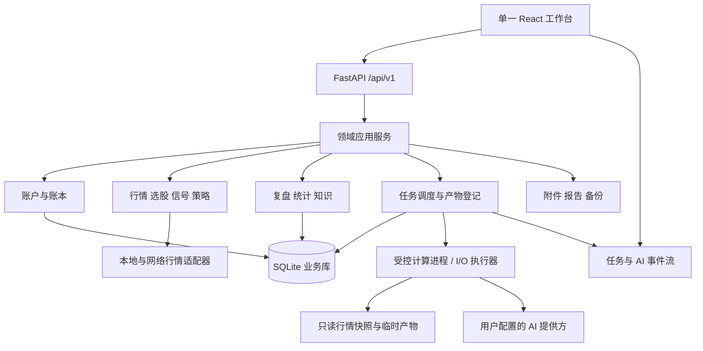
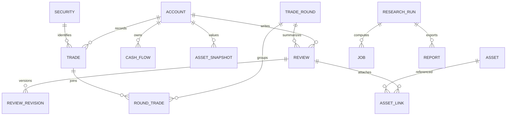
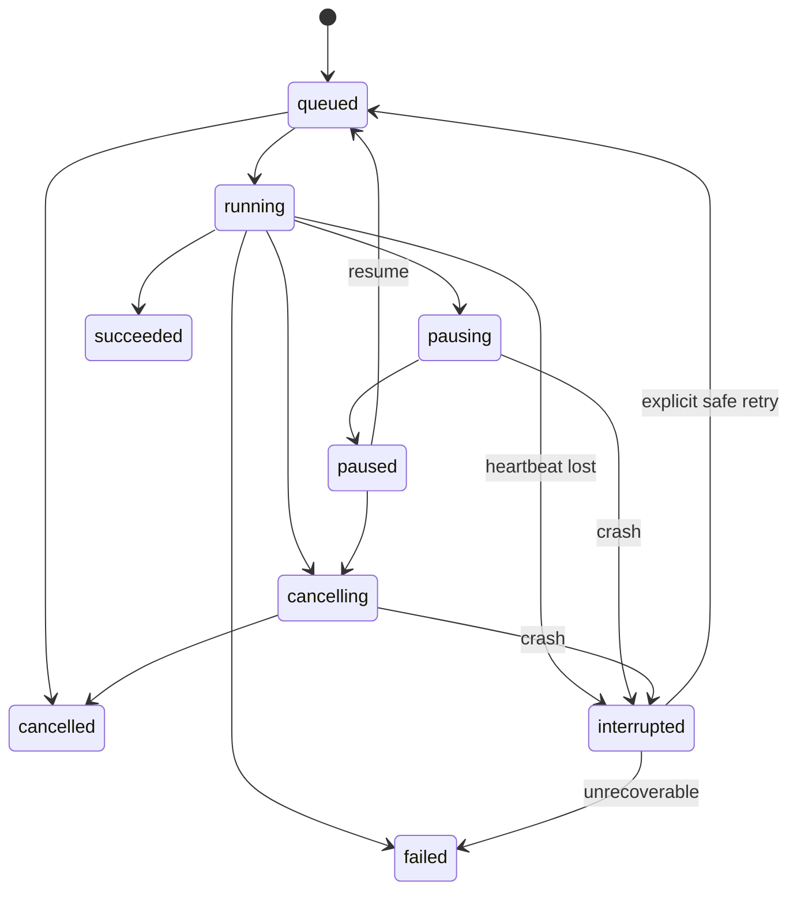

# Trade 开发文档

版本：1.0 · 2026-09-25 · 架构设计，尚未实现。

前提见 [重构入口](REBUILD_GUIDE.md)，行为以 [功能说明](FEATURE_SPEC.md) 为准。目标是可维护的完整替代系统，阶段交付不缩减最终功能范围。

架构约束与验收以 [技术要求](TECHNICAL_REQUIREMENTS.md) 的 TR-001–TR-032 为实施依据；本文件提供详细设计。实际开发先通过 G0–G2 两个最小业务流程，再扩展全部 M0–M7 能力。

## 1. 总体架构

采用 **模块化单体 + 独立计算进程**。单个 React 应用承担所有页面，FastAPI 提供统一 API；账本和业务元数据存入 SQLite；行情缓存、截图和实验产物按用途分目录。耗时扫描、回测、AI、导出由统一任务服务调度。



### 1.1 技术选型

| 层 | 选择 | 理由与约束 |
|---|---|---|
| 前端 | React + TypeScript + Vite | 沿用已有技术；一个依赖锁文件与一个构建入口 |
| UI | Ant Design + 业务组件 + CSS Variables | 以 final-trade 为基础；令牌经适配器同时驱动 AntD、自定义 CSS、ECharts |
| 状态 | TanStack Query + Zustand + 路由参数 | 服务端实体由 Query 管理；跨页 UI 草稿与视图偏好由 Zustand；过滤条件可分享进 URL |
| 图表 | ECharts，统一包装器 | 保留现有 K 线 / 分时 / 统计能力，主题变化更新图表配置 |
| API | FastAPI + Pydantic | 契约统一，生成 OpenAPI 与 TypeScript 类型 |
| 业务持久化 | SQLAlchemy + SQLite，显式迁移（拟采用 Alembic） | 本地单人部署成本低；迁移前备份；禁止 import 时改库 |
| 计算 | Python 纯领域计算 + 受控进程池 | 保留可验证算法，CPU 密集任务不占 API 事件循环 |
| I/O | 带超时 / 取消的异步客户端，必要时受限线程池 | AI 与网络请求不得在 async 路由里直接执行同步长调用 |
| 产物 | 不可变 JSON / CSV 等版本化文件，截图按内容哈希存储 | 复用原行情格式；大结果不塞入单个 JSON 状态文件 |
| 交付 | Windows 启动器 / EXE、macOS 构建、Linux 同源部署 | 保留原交付能力；共享一套 API 与前端 |

这里是选型，不是“最新版本”声明。M0 根据锁文件与目标运行环境固定一组经构建验证的版本，并记录 Node / Python 支持范围。已有 Vite 安装要求与旧 README 的 Node 18 描述不一致，不能继续沿用该描述。图标统一使用现有 AntD 图标体系；字体优先系统字体，PDF 中文字体作为离线资源打包。

### 1.2 模块依赖

- `trading` 管理账户、账本、资金、模拟交易；提供纯执行规则内核，不依赖研究、复盘或 AI。
- `analytics` 消费账本与估值的只读输入，生成版本化持仓 / 回合分析视图、净值、节点和统计；模拟下单使用交易域的即时现金 / 持仓状态。
- `market` 负责证券、交易日历、数据提供方差异和冻结行情，策略不能绕过它自行抓取网络数据。
- `research` 包含 strategies、选股、信号与 backtests，接收冻结数据并使用公开的交易规则内核；插件不能直接改数据库或下单。
- `reviews` 通过查询接口关联交易 / 回合 / 统计快照；`ai` 生成草稿与建议，由所属业务用例接受后写入。
- `platform` 提供 jobs、配置、凭据、附件、备份、事务和生命周期设施；跨域流程在应用用例服务编排。
- CI 检查循环依赖、私有模块跨域导入和领域核心的基础设施依赖；允许的公开路径与例外有记录，详见 TR-002–TR-004。

## 2. 从零建立的目录

以下为新实现的目标目录，不表示现在已存在。开发开始时使用新分支 / 隔离工作目录搭骨架，保持原仓库可对照；本轮没有执行替换。

```text
Trade/
  frontend/
    src/
      app/                    路由、布局、提供方、启动
      features/
        dashboard/ market/ screener/ charts/ signals/ strategies/
        backtests/ trading/ capital/ analytics/ reviews/ insights/ ai/ settings/
      shared/
        api/                  生成契约、请求与错误适配
        ui/                   PageHeader、DataTable、Money、Editor 等
        theme/                JSON → CSS / AntD / ECharts 适配
        charts/               图表容器、主题与可访问数据表
        formatting/           单位、日期、精度
  backend/
    trade_app/
      bootstrap.py            显式初始化与生命周期
      api/v1/                 routers、输入输出模型、依赖
      modules/
        trading/              accounts、ledger、capital、simulation、kernel
        research/             strategies、screener、signals、backtests
        market/ analytics/ reviews/ ai/
        platform/             jobs、settings、assets、backup、lifecycle
      infrastructure/
        db/                   ORM、repository、事务
        providers/            行情、AI、系统凭据存储
        files/                附件、原子写入、备份
      workers/                任务处理器、检查点、IPC
    migrations/
    tests/                    单元、契约、集成、固定样本
  packages/contracts/         OpenAPI 快照与生成说明
  design/                     运行期唯一 tokens 源及生成器（从 docs 规范落地）
  tools/research/              原独立脚本的明确继承入口
  scripts/                    开发、构建、发行验证
  deploy/                     服务端部署与行情同步
  docs/                       设计、决策、验收记录
```

单个模块内部通常分 `domain.py / service.py / repository.py / schemas.py`，规模足够大再拆目录。页面只编排子模块、数据请求与交互状态，不把导出、格式转换、领域运算写入数千行页面。避免继续以一个 `store.py` 承担全部业务。

## 3. 数据模型

### 3.1 通用约定

- 业务 ID 使用稳定字符串 ID；所有业务外键启用约束。派生结果也有版本，不能依靠数组下标标识。
- `created_at / updated_at` 为 UTC 带时区时间；业务 `trade_date / review_date` 为市场当地日期，A 股默认 Asia/Shanghai。前端显示格式不决定后端日期计算。
- SQLite 中金额用整数最小单位保存，**不用 SQLite 浮点列承载资金账本**。结算金额单位为分；价格用 `price_units` + `price_scale`，手续费率、净值、份额用规范 Decimal 字符串及限定精度。API 里的金额 / 比率传十进制字符串。
- 计算使用 Decimal，最终结算按费用规则统一舍入。展示金额默认 2 位、价格按证券精度、净值 4 位；计算不能用显示后的小数继续运算。行情 / 统计浮点计算须定义容差与版本。
- 业务记录有 `revision`；更新请求携带预期版本；审计记录包含操作、实体、前后版本与原因，不含密钥。
- 真实 / 模拟隔离依靠外键和查询条件，不只依靠前端下拉框。

### 3.2 核心实体

| 领域 / 表 | 关键字段 | 约束与责任 |
|---|---|---|
| `accounts` | id、name、kind(real/sim)、currency、market、rule_profile_id、status | 不能把含交易的账户从 real 改成 sim |
| `account_input_versions` | account_id、input_revision、updated_at | 影响统计的事实变更时，在同一事务递增 |
| `rebuild_requests` | account_id、earliest_date、target_input_revision、change_kind、state | 与事实修订同事务登记；合并最早受影响范围和最新版本 |
| `projection_versions` | account_id、range、input_revision、data_manifest_id、calculation_version、result_ref、state | 一致输入整批计算；发布前核对版本；查询使用同一批次 |
| `securities` | id、exchange、code、name、asset_type、price_scale、lot_rule | exchange+code 唯一；支持历史名称 / 别名 |
| `cash_flows` | account_id、date、kind、amount_minor、sequence、note、revision | 初始 / 入金 / 出金；金额正数，方向由 kind 表达 |
| `trades` | account_id、security_id、date、time?、sequence、side、price_units、qty、source、import_item_id?、revision | 真实流水事实；编辑 / 作废保留审计；导入项唯一 |
| `trade_fees` | trade_id、component、calculated_minor、actual_minor、override_reason、fee_profile_version | 分项保留计算值和实际值；不能回溯修改历史实付费用 |
| `orders / fills` | account_id、side、qty、status、client_order_id、price_rule、fee_snapshot、filled_qty | 模拟委托与成交；client_order_id 在账户内唯一 |
| `position_lots` | account_id、security_id、source_fill_id、opened_on、remaining_qty、cost_minor、sellable_on | FIFO；不得负数量；真实账本可重建推导，不混入模拟批次 |
| `asset_snapshots` | account_id、date、assets_minor、cash_minor?、position_value_minor?、source、revision、confirmed | 每账户日期一个当前版本，保留修订；估算与确认分开 |
| `snapshot_positions` | snapshot_id、security_id、qty、price_units?、market_value_minor?、price_date? | 现金 / 市值缺失使用 null；与快照有一致性检查 |
| `nav_segments / nav_points` | account_id、segment_id、date、units_decimal、nav_decimal、source_revision、quality | 净值段支持清算 / 零净值边界；历史输入变动失效重算 |
| `goal_profiles / node_events` | account_id、version、wave_pct、node_count；level、lit/extinguished、date、nav | 节点派生事件使用目标版本；可复算 |
| `trade_rounds / round_trades` | account_id、security_id、round_id、status、revision；trade_id、order | 稳定回合身份；拆分 / 合并保留 lineage |
| `reviews` | account_id、kind(daily/weekly/monthly/round)、period_key、round_id?、content_json、schema_version、revision | kind 对应必填结构；期间复盘账户+类型+期间唯一；不把任意 HTML 当正文 |
| `review_revisions` | review_id、revision、origin(manual/ai/import)、content、context_snapshot_id? | AI 草稿与接受动作有独立记录 |
| `review_scores` | review_id、trade_id/group_id?、dimension、ai_value、final_value、manual_override、comment | 维度 schema 版本化；旧扩展维度不丢失 |
| `plans / plan_positions` | account_id、written_on、target_date、forecast、risks、watchlist；security_id、qty、condition | 原 next_* 字段映射；目标交易日与创建日期分开 |
| `tags / tag_assignments` | scope、type、name；entity_type、entity_id、account_id | 标签删除不级联删业务；实体引用校验 |
| `insight_cards` | content、tags、created_at、revision | 卡片温故的选择结果按日期记录 / 稳定计算 |
| `annotations` | security_id、scope、content、revision、source | 人工字段与 AI 字段独立；图表草稿恢复 |
| `import_batches / import_items` | type、source_asset_id、state、raw_result、normalized_data、dedup_key、confirmed_entity_id | OCR 不直接写 trades；幂等确认 |
| `assets / asset_links` | content_hash、size、mime、relative_path；owner_type、owner_id | 内容寻址不可变；链接由业务事务创建；清理有宽限期 |
| `strategy_versions / parameter_sets` | strategy_id、version、schema、defaults、capabilities、code_hash；params、hash、origin | 实际运行冻结解析后的值；只读项受服务端约束 |
| `event_profiles` | id、version、content、hash | 应用新版本不改旧运行引用 |
| `research_runs / signal_baskets` | kind、input_snapshot、data_manifest_id、result_ref、algorithm_version；constituents、entry_rule | 覆盖筛选、共振、信号篮子与回测；具体结果 schema 分类型 |
| `jobs / job_events / checkpoints` | type、state、progress、attempt、worker_token、heartbeat、request_hash、result_ref | 状态持久化、幂等发布产物，见第 6 节 |
| `reports` | run_id、manifest、files、hash、schema_version、source | 包内附件路径不能外逃；导入保留来源 |
| `ai_providers / ai_sessions / ai_messages / ai_runs` | provider、model、secret_ref；role、status、context_hash、usage?、result | 内容按本地数据管理；敏感凭据不放消息 / 普通设置 |
| `parameter_proposals` | target、base_revision、diff、status、accepted_revision? | 应用采用 compare-and-swap，防止覆盖新版本 |
| `settings / saved_views / audit_events` | scope、key、schema_version、value；entity_ref、operation、revision | 设置类型化；可恢复参数收藏在后端，UI 缓存不是唯一来源 |



### 3.3 文件布局与读写

```text
用户明确选定的新 Trade 数据目录/
  app.sqlite
  assets/sha256/...              不可变截图与附件
  market-cache/provider/...      可重建行情缓存
  datasets/<manifest-id>/        被实验引用的数据清单 / 必要冻结片段
  artifacts/<run-id>/            结果、报告、检查点
  staging/<operation-id>/        导入 / 恢复 / 计算临时文件
  backups/                      显式保留策略
  logs/                         脱敏日志
```

根目录规范化为绝对路径；所有数据库保存的文件引用为受控相对路径。业务写入由 API 的事务服务统一提交。计算进程读取冻结输入，把产物写入自己的 staging；校验成功后由 API 登记并原子发布，禁止多个计算进程自行修改账本。SQLite 开启外键、WAL、忙等待；API 事务短小，不在事务中等 AI / 网络。

同一数据根只有一个应用实例获得锁。文件损坏进入恢复模式，保留原件并显示错误；禁止捕获任意异常后初始化空账户覆盖旧文件。

历史事实修改与重算请求同事务保存；派生结果在 staging 计算，校验输入版本仍有效后切换结果指针。统计返回 fresh / recalculating / stale / failed 与版本，迟到结果不得覆盖最新批次。人工确认快照保留原值。完整流程及竞态验收见 TR-005–TR-009。

## 4. API 与契约

### 4.1 一致约定

- 基础路径 `/api/v1`，资源名复数。API 版本与数据 schema、算法版本相互独立。
- JSON 成功：`{data, meta:{request_id, ...}}`；列表含 `next_cursor`；默认 50、上限 500；日期范围显式 inclusive，金额字段附契约单位。
- 错误：`{error:{code,message,fields?,retryable,request_id}}`。参数错误 422、状态 / 版本冲突 409、无访问权 401/403、不存在 404；外部依赖错误不伪装成成功空结果。
- 长任务提交返回 202 与 `job_id`；前端订阅 SSE 或有退避的轮询。数据导出返回文件响应，SSE 返回事件流，不套 JSON 外壳。
- 新建交易、确认导入、提交订单、重置、恢复、应用建议等操作接受 `Idempotency-Key`。服务端按会话 / 账户 / 操作作用域保存请求哈希与结果；同键不同请求返回 409。
- 修改采用 `revision` / `If-Match`，冲突时返回最新版本供用户比较，不自动覆盖另一页已保存内容。
- 类型从 OpenAPI 生成，生成产物提交；CI 检查生成结果与后端契约一致。

### 4.2 资源规划

| 资源 | 典型操作 | 对应功能 |
|---|---|---|
| `/accounts` | 创建 / 列表 / 归档；账户规则配置 | F01–F02、F39 |
| `/accounts/{id}/trades` | 真实交易 CRUD / 作废、修订 | F41、F44 |
| `/accounts/{id}/orders` | 模拟下单、列表、`/{orderId}/cancel` | F24、F36 |
| `/accounts/{id}/settlements`、`/reset-previews` | 结算任务、重置预览后执行 | F37 |
| `/accounts/{id}/portfolio`、`/rounds` | 持仓 / 回合只读、摘要链接 | F38、F45 |
| `/accounts/{id}/cash-flows`、`/snapshots`、`/nav`、`/goals` | 资金 / 估值 / 净值 / 节点 | F46–F51 |
| `/imports`、`/{id}/items`、`/{id}/confirm` | 截图批次、编辑与确认 | F42–F43、F47 |
| `/securities`、`/{id}/candles`、`/intraday`、`/annotations` | 搜索、行情、图表 | F04–F05、F11–F13 |
| `/market/...`、`/market/syncs` | 趋势 / 梯队 / 板块 / 异动 / 估值 / 资讯、同步 | F03、F06–F07、F14–F18、F61 |
| `/research/runs` | type=screener/b1/signals/cross_validation/signal_basket | F08–F10、F23、F25–F27 |
| `/strategies`、`/parameter-sets`、`/event-profiles` | 注册器、参数、事件配置 | F19–F21、F35 |
| `/backtests`、`/plateau-runs`、`/reports` | 实验、参数扫描、报告与导入 | F28–F34 |
| `/reviews`、`/{id}/revisions`、`/plans`、`/review-scores` | 日 / 周 / 月 / 回合、预研、评分 | F52–F58、F69 |
| `/tags`、`/tag-assignments`、`/analytics`、`/insights` | 标签统计、汇总、灵感 | F40、F51、F59、F62 |
| `/ai/providers`、`/sessions`、`/runs`、`/prompts`、`/usage`、`/parameter-proposals` | AI 全部统一入口 | F63–F69 |
| `/assets`、`/exports`、`/backups`、`/restore-previews` | 附件、分享 / PDF / 表格、备份恢复 | F60、F70–F73 |
| `/jobs`、`/{id}/events`、`/{id}/pause`、`resume`、`cancel` | 统一任务状态与能力 | F26、F32、F64 |
| `/system/storage`、`/storage-move-previews`、`/settings`、`/session` | 系统状态与维护 | F01–F02、F74–F78 |

这是新 API 的分组约定；M0/M1 输出详细 OpenAPI 后冻结字段。旧 173 个接口的行为映射保留在原始清单中，新路径数量无需一一相等。

### 4.3 示例：确认识别结果

```http
POST /api/v1/imports/imp_001/confirm
Idempotency-Key: confirm-imp_001-v3
Content-Type: application/json

{
  "account_id": "acc_real_001",
  "expected_revision": 3,
  "item_ids": ["item_001", "item_002"],
  "duplicate_resolution": "require_review"
}
```

预检先返回逐行错误 / 疑似重复；有未处理错误时不提交该批。全部有效后在一个事务中创建交易与确认引用。重复请求返回同一批交易 ID。选择“只确认有效行”必须先形成明确子集并由用户提交，不能后台悄悄略过错误行。

### 4.4 示例：运行输入快照

```json
{
  "kind": "backtest",
  "strategy": {"id": "wyckoff_trend_v1", "version": "1.0.0", "code_hash": "sha256:..."},
  "parameters": {},
  "dataset_manifest_id": "dataset_001",
  "range": {"from": "2025-01-02", "to": "2025-12-31"},
  "price_adjustment": "none",
  "execution_profile_version": "legacy-compatible-v1",
  "event_profile_version": "events_001:v1",
  "calculation_version": "backtest-v1",
  "random_seed": null
}
```

数据 manifest 含证券范围、文件 / 分区内容摘要、来源、采集日与截至日。若某模型需要随机性，记录种子；旧数据无法完整复现时标记数据不足，不能宣称精确重放。

还须冻结证券集合、交易日历、复权因子与相关依赖版本；区分事件时间、提供方可得时间和实际采集时间，缺历史可得性时标记假设。缓存标识覆盖所有相关输入与算法版本，具体要求及验收见 TR-013–TR-015。

## 5. 一致性与导入导出

### 5.1 安全备份与恢复

备份包 manifest 至少含：`format_version`、应用版本、数据库 schema、创建时间、账户范围、表及数量、每个文件 SHA-256、缺失资源清单、是否包含凭据。默认不含 API Key；凭据另由系统凭据存储管理。

1. 进入短维护窗口：停止新写入，完成事务，暂停可暂停任务。
2. 使用数据库一致性备份机制创建数据库快照；收集该快照引用的不可变附件和报告。
3. 暂停附件垃圾回收，复制所需文件，完成摘要校验；临时包原子改名后才显示成功。大行情缓存可选择排除，manifest 明示重建需求；复现实验依赖的数据须保留或明示缺失。
4. 恢复先验证版本、表结构、数量、范围、外键、文件哈希与路径；在 staging 恢复到临时库，执行迁移和只读核对。
5. 用户看到账户 / 记录数 / 附件变化的具体预览后执行替换；先为当前库建立恢复点。
6. 关闭数据库连接，原子切换完整数据集，受控重启。失败回到原数据根，不能只切数据库而遗漏附件。

合法空库备份允许恢复，但必须在预览中明确显示将清空的范围。只含 `exported_at` 的文件无效，不得触发删除。旧版 JSON 缺失 RoundReview 或图片时提示“源备份未包含”，不能声称已恢复这些数据。

### 5.2 数据目录切换

预览目标绝对路径 → 校验容量 / 可写 / 空目录 / 非当前子目录 → 维护锁 → 一致性复制 → 校验 → 写新根指针 → 启动器受控重启 → 健康检查 → 标记完成。失败保持原根与指针。源数据暂时保留供回退，不自动删除。服务端部署禁用本机目录选择对话框，使用管理员配置范围。

### 5.3 原数据与未来迁移

本阶段新库独立，不自动使用 `~/.tdx-trend` 或 L 旧数据库。以后迁移必须由用户主动选源，源以只读快照接入，先生成记录数 / 单位 / 字段 / 重复 / 冲突报告，再导入新账户。建立 `(source_system, source_entity, source_id)` 映射，二次导入幂等。原 JSON / SQLite / 图片路径保留关联；浏览器中的参数收藏、分享草稿和偏好通过原前端导出助手获取，不能假设后端能直接读取任意浏览器 localStorage。

### 5.4 导出服务

导出输入是固定数据快照与模板版本，不能在分页渲染中不断取变化数据。PDF、Markdown、CSV、Excel、分享 PNG、回测报告包各自保持原入口与字段。正文按文本 / 受限 Markdown 渲染；CSV / Excel 用户文本防止被解释为公式。中文字体离线可用；输出目录在用户明确配置的范围内。打印版统一使用打印令牌，不直接复制屏幕深色背景。

## 6. 任务、并发与恢复

### 6.1 状态机



每种任务声明 `can_pause / can_resume / can_cancel / is_retry_safe`。AI 流式调用仅支持停止 / 重试，不伪装成可从任意 token 继续的回测检查点。扫描类无可靠检查点时只能取消后重跑；原回测 / 平原需要保留暂停与继续。

### 6.2 实现规则

- API 调度器从持久化 jobs 领取任务并分配 worker_token，经本地 IPC 发给进程；只有 API 事务服务改变任务状态和业务数据。进程数量、CPU / 内存预算可配置，默认限制并发。
- CPU 任务按交易日 / 参数点边界保存原子检查点；含输入摘要、策略版本、当前持仓现金、游标、随机状态与已完成分片。继续前验证输入摘要一致。
- Worker 心跳与结果带 attempt / token；旧进程的迟到结果不能覆盖新尝试。
- 任务取消先发信号，等待安全边界；超时由启动器终止拥有的 worker。发布成功前检查取消状态；取消不产生完整成功报告。
- 重启将遗留 running 标为 interrupted；由校验决定可继续、需重跑或不可恢复。恢复不能重复执行订单、确认导入、应用参数等有副作用动作。
- SSE 事件有单调 event_id，支持断线重连；前端刷新时先读状态快照再订阅。进度未知显示阶段，不虚构百分比。
- 普通查询不等全市场扫描；AI / 回测运行时用户仍能保存复盘。队列满返回排队状态或明确拒绝原因。

初版本地运行一个 API 进程；未完成机器基准时启用一个 CPU worker。CPU / I/O 并发、内存、磁盘、超时与排队预算显式配置；进程传数据引用，进度限频合并，后台计算为交互保存保留资源。完整规则见 TR-016–TR-020。

## 7. 前端工程与交互

- 单一 AppShell、路由、主题提供方、QueryClient、错误边界；删除最终产品中的 iframe 嵌套导航。
- 页面拆为查询面板、结果表、详情、图表与动作区。业务 hook 只负责相应领域，不把导出实现和账本公式放到组件。
- 路由参数用于账户、日期和可分享过滤；服务端持久化业务收藏与草稿；localStorage 只保存主题 / 密度 / 页大小等可重建偏好。
- 保存具有版本和恢复草稿。网络恢复后比对服务端 revision，不盲目自动覆盖。切换账户取消旧请求并按 account_id 隔离 Query key。
- 启动前同步读取主题偏好，避免首屏闪白；AntD / CSS / 图表 / 打印都来自同一令牌源。
- 通用组件及布局规范见 [DESIGN_SYSTEM.md](DESIGN_SYSTEM.md)。所有计算结果显示数据范围、单位、截至日和缺失状态。

## 8. 访问与凭据

本地默认只监听 loopback；校验 Host / Origin，同源部署不开放 `*` CORS。启动器生成临时交换凭证，换取 HttpOnly / SameSite 会话后清理 URL 凭证；写接口校验 CSRF。关闭、目录迁移、恢复和模拟重置要求有效会话与具体影响范围确认。远程部署必须启用登录和 HTTPS / 受控反向代理，禁止把免登录桌面端直接监听公网。

API Key 保存到操作系统凭据服务；配置只存引用。平台没有可用凭据后端时要求环境变量或明确配置安全存储方式，不自动退化为普通 JSON 明文。用户配置 AI endpoint 属显式设置，测试结果不回显密钥。AI 上下文只包含所选账户 / 页面所需字段；上传图片要限制大小、类型、解码尺寸并使用内部文件名。

这些要求对应前序代码审查中可复现的跨域导出、密钥备份和危险恢复问题，不将“本地单人”视为可以跳过访问边界。

## 9. 测试与验收

### 9.1 验证层次

| 层次 | 必须验证的内容 | 产物 |
|---|---|---|
| 领域单元 | Decimal 费用、FIFO、回合边界、NAV / 零净值、出入金、节点、ISO 周 | 固定例子 + 边界 / 不变量 |
| 原版对照 | 16 个策略、筛选 / 信号、矩阵 / 传统回测、异动、统计口径 | 相同输入的新旧结果差异报告 |
| API 契约 | 类型、账户隔离、版本冲突、错误码、幂等 | OpenAPI 快照 + 集成结果 |
| 数据恢复 | 错备份、附件缺失、进程崩溃、磁盘满、迁移失败、schema 升级 | 原库未变 / 完整回退证据 |
| 任务 | 暂停继续、取消竞态、重启恢复、迟到结果、AI 超时 | 状态序列与产物校验 |
| 页面 E2E | 建账 → 交易 → 快照 → 复盘；筛选 → 回测 → 模拟；备份恢复 | 每个 F ID 的入口与关键路径记录 |
| 视觉 / 可用性 | 浅深色、键盘焦点、320/768/1280/1440px、长表与中文 PDF | 组件样例 / 关键页截图 / PDF |
| 发行 | Windows、macOS、Linux 对应启动 / 构建 / 路由 / 数据目录 | 平台验收矩阵；未测平台明确标未验收 |

先固定最小可信样本，不用 live 网络结果作为唯一回归基准。算法差异分为预期兼容、明确缺陷修正、未知回归；未知差异阻止对应功能验收。已有 266 项后端、前端测试等前序审查结果仅属于旧整合版，不能当作新系统测试通过。

### 9.2 发布硬门槛

1. F01–F78 对照表无未解释缺口，所有原功能各有验收记录。
2. P0 数据 / 访问问题清零；完整备份往返后交易、回合摘要、复盘、附件、参数与报告一致。
3. AI / 回测运行时记账与保存仍可用；损坏状态不被默认数据覆盖。
4. 16 个策略有冻结样本差异报告，独立研究脚本有明确继承入口。
5. 构建命令非零退出立即失败；前后端版本、静态资源清单和数据 schema 一致；禁止打入旧 dist 冒充新产物。
6. 可从空白环境启动，资产路径和所有深链接有效；不依赖开发机缓存和 Google Fonts 网络。

### 9.3 性能目标（待 M0 基准实测）

使用一台记录 CPU / 内存 / SSD / OS 的普通开发机，固定 100,000 笔交易、5,000 篇复盘、约 5,000 标的 × 1,000 日行情基准。期望：本地分页查询 p95 < 300ms；普通保存 p95 < 500ms；任务入队响应 < 1s；任务阶段变化 2s 内反映到 UI。全市场扫描 / 回测先记录基线吞吐与峰值内存，再设可达预算，不能空口承诺秒级全市场计算。

## 10. 实施与切换策略

M0–M7 为完整能力里程碑：功能与规则基线、公共基础、账本 / 资金 / 模拟、复盘统计、行情研究、回测、AI / OCR、输出与交付。具体任务按业务依赖选择，优先完成下列端到端门槛：

1. G0：独立空库、统一外壳、事务 / 迁移 / 契约、最小备份与架构检查。
2. G1：建账户 → 手动交易 → 快照 → 净值 → 日复盘 → 备份恢复；验证历史修改后的重算。
3. G2：一个数据源 → 一个原有策略 → 回测 → 模拟交易 → 结果核对；验证共享内核与任务资源预算。
4. G3：补齐各里程碑的全部功能；G4：按 F01–F78 与 TR-001–TR-032 验收完整替代。G1/G2 不等于全量完成。

原项目持续可用；新系统使用新数据根。每个阶段交付可运行闭环和验收证据，不以复制大文件代替重构。完成 M7 后先在新数据副本验收完整替代，再由用户决定是否导入历史数据和切换日常使用。具体开发任务见 [DEVELOPMENT_TODO.md](DEVELOPMENT_TODO.md)。
