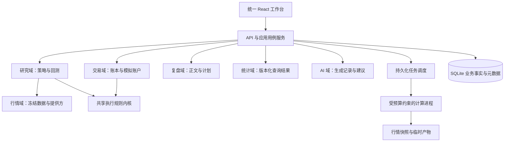
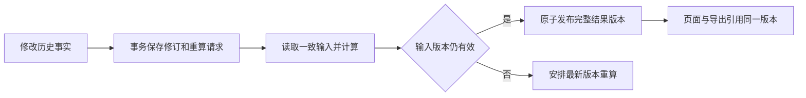

# Trade 重构技术要求

版本：1.0 设计基线 · 实施更新 2026-09-26。本文保留开发约束；当前能力、已执行门禁和发布平台限制分别见 [实施状态](IMPLEMENTATION_STATUS.md)、[逐功能核对](FEATURE_COMPLETION_AUDIT.md)，不再用早期阶段进度代表当前实现。

## 1. 目的与适用范围

本文将架构讨论中的全部七项建议转为可执行、可检查的技术要求，并汇总已有方案中的前端、契约、AI、备份和交付约束，供开发和代码审查使用。

目标产品：基于 final-trade 与 LaimiuTrade 重构统一 Trade，完整承接两个项目的功能。采用一个 React 前端、一个模块化 FastAPI 后端和受控计算进程；默认单人、本地优先，保留服务端部署能力。

### 1.1 文档关系

| 文档 | 职责 |
|---|---|
| 本文 | 架构边界、必须遵守的技术规则、验收门槛 |
| [功能说明](FEATURE_SPEC.md) | F01–F78 的业务能力与行为；原 173 个接口、28 个业务页面、16 个策略的承接范围 |
| [开发文档](DEVELOPMENT_SPEC.md) | 目录、实体、接口、任务与部署的详细设计 |
| [开发 TODO](DEVELOPMENT_TODO.md) | 实施任务、依赖关系与证据记录 |
| [设计规范](DESIGN_SYSTEM.md) / [令牌](design-tokens.json) | 界面、图表、打印与主题数值 |
| [代码审查](archive/CODE_REVIEW_TODO.md) | 旧实现问题的证据与防回归条件 |

本文细化架构约束，不改变功能范围、原数据保留和 final-trade 作为视觉基础的决定。若实现设计与本文冲突，应在合入前形成架构决策记录，列明原因、替代方案和验证证据，并同步相关文档；功能删减、自动迁移旧数据等范围变化仍需用户决定。

### 1.2 用语与优先级

- **必须**：对应功能验收的硬条件。
- **应**：默认实施方式；替代方案须记录理由和验收证据。
- **P0**：涉及数据正确性、可恢复性和系统边界，应先建立。
- **P1**：完整替代版本发布前必须完成。
- 每条要求以 `TR-xxx` 标识。编号存在、文档写完均不等于实现通过。

### 1.3 七项建议的覆盖关系

| 架构建议 | 技术要求 |
|---|---|
| 明确模块边界并由 CI 约束 | TR-001–TR-004 |
| 历史修改后可靠重算 | TR-005–TR-009 |
| 模拟与回测共用执行规则内核 | TR-010–TR-012 |
| 行情版本与当时可获得的信息进入运行输入 | TR-013–TR-015 |
| 后台计算有资源预算 | TR-016–TR-020 |
| 按用途分离存储 | TR-021–TR-024 |
| 优先验证完整业务流程 | TR-025–TR-026 |

TR-027–TR-032 承接前端、设计令牌、API、AI、访问与恢复、测试发布方面的既有建议。

## 2. 目标架构与领域边界



### TR-001 · 单一应用与统一上下文 — P0

必须提供一套路由、导航、设置、主题、账户范围和 API 契约。最终业务页面在同一前端内实现。真实账本、模拟账户、回测实验分别以 `account_id + kind` 或 `run_id` 标识；后端校验范围，不依赖前端显示标签实现隔离。

**验收：** 可从同一外壳访问全部业务；跨账户使用记录 ID 返回拒绝 / 不存在；真实账本操作不能生成模拟成交，回测结果不能直接改变账户余额。

### TR-002 · 六个业务域与公共设施 — P1

| 领域 | 唯一责任与数据所有权 |
|---|---|
| `market` 行情 | 证券标识、交易日历、提供方、复权与价格口径、行情缓存与快照 |
| `research` 研究 | 策略注册、参数、选股、信号、交叉验证、回测、收益平原、研究产物 |
| `trading` 交易 | 账户、真实成交、模拟委托 / 成交、费用、资金流、确认资产快照、交易规则内核 |
| `reviews` 复盘 | 日周月与回合正文、评分、计划、标签、灵感、人工修订 |
| `analytics` 统计 | 从交易事实与估值生成持仓 / 回合分析视图、净值、回撤、节点和汇总；管理统计版本 |
| `ai` AI | 模型调用、上下文快照、会话、生成结果、用量、待接受建议 |
| `platform` 公共设施 | 生命周期、配置、凭据、事务、任务、附件、导出编排、备份、审计；不承载业务算法 |

原目录方案中的 accounts、ledger、capital 等作为交易域内部子模块；strategies、backtests 等作为研究域子模块。模拟执行所需的即时持仓 / 现金由交易域维护；统计域的持仓报表属于查询结果，二者的用途与版本必须区分。

**验收：** 每张业务表、运行产物和写操作有明确所属领域；评审能指出“谁有权修改它”；跨域不存在第二套资金或收益计算实现。

### TR-003 · 依赖规则与 CI 检查 — P1

必须满足：

- 领域核心不导入 FastAPI、React、ORM 会话或网络客户端；通过输入对象与接口表达需求。
- 交易域不依赖研究域、复盘域或 AI 域；接收研究结果时使用明确的数据契约与来源 ID。
- 研究域可调用交易域公开的纯规则内核；策略插件通过行情接口读取冻结数据，不直接访问提供方或写入账本。
- 统计只读交易事实；复盘通过公开查询接口关联事实和统计。AI 生成草稿 / 建议，由对应业务用例接受后写入。
- 各域只能使用公开接口，不能跨域导入私有 repository、直接改表或访问内部可变状态。
- 跨域流程由应用用例服务编排；公共设施不反向依赖某个业务域实现。

CI 应检查禁止的依赖与循环依赖，检测到越界必须失败。规则应覆盖 Python import 和前端 feature 导入；必要例外须列明允许的公开路径。

**验收：** 人为加入一条越界依赖时检查失败；删除后通过；运行架构检查不初始化数据库、不访问网络。

### TR-004 · 显式启动与按用例拆分 — P0

数据库、配置、provider、worker 在应用生命周期中显式构造和关闭。import 模块不得创建数据目录、修改数据库、启动任务或扫描行情。API router 只负责输入校验、调用用例和响应映射；页面只负责交互编排。

**验收：** 导入纯业务模块不产生文件；测试可注入临时库、固定时钟与假 provider；一个功能的变更能定位到其模块，避免回到集中式 `store.py`。

## 3. 历史修改、重算与数据一致性

### TR-005 · 原始事实与派生结果分层 — P0

原始事实包括：交易及其修订、出入金、已确认资产快照、模拟委托与成交、人工复盘内容。分析持仓、回合归组、净值、回撤、节点和统计报表应可由这些事实及明确的行情 / 规则版本重建。

人工确认快照保留其实际记录值。流水估算或新行情只能产生估算版本 / 核对差异，不能自动覆盖确认值。回合拆分、合并必须保留人工摘要及原关联，不能因重新归组删除正文。

**验收：** 删除测试库中的派生结果后能重建；更正交易后确认快照、人工复盘和摘要仍存在；差异可定位到来源。

### TR-006 · 版本、精度与即时交易状态 — P0

必须采用：

- 每条可修改事实的 `revision`，以及按账户维护的输入版本 `input_revision`。
- 金额整数最小单位、价格带精度、Decimal 运算与明确舍入规则；API 金额使用十进制字符串。
- 模拟下单、撤单、成交与结算，事务内校验当前现金 / 可卖持仓，不能读取滞后的统计报表作风控判断。
- 模拟成交记录通过明确的更正 / 调整用例处理，保留审计；真实历史流水允许有版本的修改。

**验收：** 两个同时提交的订单不能超用现金 / 可卖数量；历史修改有前后版本；金额边界、部分卖出、零净值和出金归零结果符合功能说明。

### TR-007 · 原始修改与重算请求同事务保存 — P0

修改影响统计的事实时，同一数据库事务必须完成：事实修订、账户输入版本递增、审计、重算请求登记。重算请求至少含账户、最早受影响日期、变更类型与目标输入版本。

应合并同一账户的待重算范围，保留最早日期和最新输入版本。后台调度从持久化记录领取工作，不依赖内存消息保证执行。算法不能证明可增量处理时，应重算受影响账户的完整区间。

**验收：** 在提交后、worker 启动前模拟崩溃，重启仍能找到待重算任务；回滚交易修改时也不会留下有效的孤立重算请求。

### TR-008 · 一致读取与整批发布 — P0

计算输入必须是一个一致的事实版本，并绑定行情与规则版本。worker 在临时区域生成结果；API 校验成功后，在短事务中切换该范围对应的结果版本指针。

发布前比较目标输入版本。若期间发生更新，旧结果不得标为最新，应保留为历史或丢弃发布并安排新计算。图表、指标卡、回合列表须按同一结果版本读取，避免一次页面请求拼接不同批次。

建议派生结果记录：`projection_version`、`input_revision`、`calculation_version`、`data_manifest_id`、计算范围、生成时间与质量状态。

**验收：** 连续两次修改且先发任务后完成时，新版本不被旧任务覆盖；重算一半失败不向用户暴露半套结果；重复执行不重复生成节点事件。

### TR-009 · 页面明确新旧与失败状态 — P0

统计响应包含：`fresh / recalculating / stale / failed`、结果版本、来源日期和错误摘要。重算期间可展示最近完整结果，但必须显示“更新中 / 尚未反映最新修改”；失败保留原事实与最近完整结果，并提供重试入口。

**验收：** 用户修改历史记录后立即能看到状态变化；失败不能显示“已更新”；导出记录实际使用的版本与是否过期。



## 4. 模拟交易与回测的共享规则内核

### TR-010 · 共享计算规则 — P0

交易域提供可独立测试的内核，覆盖费用与舍入、持仓批次、成本分摊、交易单位、可卖数量、现金变化、订单状态转换、已实现 / 浮动盈亏。规则需要显式版本；内核不得自行获取系统时间、读写数据库或请求行情。

输入包括账户状态、订单 / 成交意图、市场规则、费用配置、时钟与行情视图；输出包括新状态、成交 / 拒绝结果、费用明细和可审计计算信息。内核输出由相应应用服务持久化。

**验收：** 同一状态、规则和输入在模拟 / 回测入口得到相同资金与持仓结果；固定输入重复调用结果稳定；变更手续费只维护一处规则实现。

### TR-011 · 时钟与成交模型分别适配 — P1

模拟执行与回测分别提供时间推进、行情读取和成交模型。回测还必须指定同 K 线多触发处理、延迟入场、停牌 / 缺行情处理及订单生效时间。真实账本记录已发生事实，允许记录实际费用覆盖，不使用模拟撮合产生真实成交。

**验收：** 能在不修改费用 / 持仓计算代码的情况下替换时钟或成交模型；相同信号因不同执行模型产生的差异可解释。

### TR-012 · 原执行路径与策略兼容 — P1

原矩阵、传统回测路径和 16 个策略必须建立固定输入对照。先确定行为与差异，再逐项接入共享内核。保留 `strategy_version`、`execution_profile_version` 和 `calculation_version`；修复原缺陷时登记原结果、新结果、原因和受影响范围。

**验收：** 16 个策略各有正常 / 边界样例；已解释差异可追溯；未知结果差异阻止对应策略验收；原独立研究脚本有继承入口。

## 5. 行情版本与研究可复现

### TR-013 · 完整运行输入清单 — P0

每次筛选、信号、交叉验证、回测和参数扫描必须固定以下内容：

| 输入 | 必须保存的内容 |
|---|---|
| 策略 | ID、版本、代码摘要、解析后参数、事件判定配置 |
| 行情 | 实际使用的数据清单、内容哈希、提供方、字段 / 单位、日期范围、复权方式与因子版本 |
| 市场范围 | 证券集合、证券身份、交易日历版本、选样方式 |
| 执行 | 费用、滑点、交易规则、成交模型、执行路径版本 |
| 计算 | 算法版本、相关依赖 / 运行环境版本、随机种子、输入规范化版本 |

数据文件可由多个运行共享不可变分片；必须确保引用的数据内容可取得。仅记录一个后来会改变的目录路径，不满足冻结要求。

**验收：** 修改全局设置或更新行情后，旧实验仍引用原输入；文件被修改 / 缺失时重放预检失败并说明原因。

### TR-014 · 区分市场事件时间与数据可得时间 — P0

行情与相关资料应区分 `event_time`、提供方发布时间 / 可得时间、`ingested_at` 和修订版本。研究时间点 T 只能使用按声明口径在 T 可得的数据。今日下载一份历史日线的时间不能直接当作该日线当年的发布时间。

提供方不提供历史可得时间、历史证券集合或修订记录时，必须标明“假设 / 无法验证”的字段与规则。可以运行带质量说明的历史分析，但不得将其标为已验证的严格时点回测。停牌、退市、历史成分与复权资料的不足应进入质量诊断。

**验收：** 给数据样本加入晚于决策时间的资料，严格模式不能使用；仅缺采集日期时不能误删所有历史日线；未知可得性不会被包装为已验证。

### TR-015 · 缓存标识与确定性 — P1

缓存标识应包含：任务类型、规范化输入、策略 / 算法 / 执行版本、行情 manifest、证券集合与日历、随机种子。与身份有关的数据还须包含账户和输入版本。相关输入变化使缓存失效；旧结果可保留为历史产物。

**验收：** 改变复权、费用、数据内容或策略版本会得到不同缓存标识；相同种子与固定输入可重复得到规定容差内的结果；缺失计算项使用明确的未生成状态。

## 6. 后台任务与资源预算

### TR-016 · 交互与计算执行职责分开 — P0

初版本地部署使用一个 API 服务进程，处理交互、事务和任务编排；CPU 密集任务进入受控计算进程；AI / 行情请求使用有超时与并发限制的异步 I/O 或受限线程池。

worker 读取冻结输入并产生临时产物，业务库写入经 API 内的应用事务服务提交。该写入服务是进程内能力，不要求 worker 为每条结果调用一次 HTTP。

**验收：** 扫描 / 回测 / AI 同时进行时仍可保存复盘；同步长调用不占住 API 事件循环；CPU 任务不在请求函数中直接长时间运行。

### TR-017 · 并发、内存与时间预算 — P0

必须配置 CPU worker 上限、I/O 并发、任务排队上限、内存预算、临时磁盘预算、超时和取消宽限期。未完成基准测试的机器默认只启用一个 CPU worker；资源预算不足时排队或拒绝，并说明原因。

进程间应传任务 ID、数据文件引用和结果摘要；大行情对象和完整结果避免重复序列化广播。每个 worker 按需要读分片，并限制本地缓存。运行时记录峰值内存，超过预算可停止对应任务，保留可恢复状态并清理其临时资源。

多进程通常各自占用内存，扩大进程数可能同时扩大数据副本。资源配置须经样本实测，不以 CPU 核数直接决定并发。[FastAPI 官方说明](https://fastapi.tiangolo.com/deployment/concepts/#memory-per-process)

**验收：** 测试数据超过预算时返回可理解的排队 / 失败信息；worker 崩溃不终止 API；不得为回收资源终止无关进程。

### TR-018 · 检查点、进度与结果提交 — P0

任务按交易日、参数点或批次保存检查点；包含输入摘要、计算版本、已完成游标及恢复所需状态。进度更新应合并并限频；终态、失败和关键阶段不得因合并丢失。

worker 先写临时产物，再校验并提交 manifest；API 确认任务尝试编号、取消状态、文件摘要和输入版本后发布。每次尝试使用独立 staging 目录，禁止重试覆盖仍被引用的成功产物。

**验收：** 结果发布前崩溃可恢复 / 重跑；刷新后看到持久化状态；暂停继续不重复生成成交或参数点；损坏检查点拒绝恢复。

### TR-019 · 能力明确的状态机与幂等 — P0

任务必须声明 `can_pause / can_resume / can_cancel / is_retry_safe`。状态遵循开发文档的 queued、running、pausing、paused、cancelling、cancelled、succeeded、failed、interrupted 流程；使用尝试编号与 worker token 防止迟到结果覆盖。

计算任务允许安全重算；下单、确认入账、应用参数、恢复等有副作用操作必须使用独立幂等键，不能直接随通用任务重试再次执行。AI 中断后重试形成新调用记录，不宣称从任意 token 恢复。

**验收：** 取消与完成同时发生时有唯一结果；旧 worker 回报被拒绝；同一确认 / 应用请求重复发送不会产生重复业务变更。

### TR-020 · 优先级、背压与交互保障 — P1

交互查询和保存使用短事务与独立执行机会；后台计算限制并发及提交频率。任务队列区分用户主动操作与后台批量作业；必须有公平性策略，避免低优先级任务永久等待。队列满时给出排队 / 拒绝状态，支持取消已排队任务。

**验收：** 在指定基准机上，以回测 + 行情同步负载测试保存与分页查询。开发文档中 p95 查询 <300ms、保存 <500ms 为待实测目标；达不到时记录瓶颈、调整预算和最终接受值，不能将目标当作已测成绩。

## 7. 存储、恢复与扩展边界

### TR-021 · 按数据用途存储 — P0

| 数据 | 存放方式 | 生命周期 |
|---|---|---|
| 交易、资金、复盘、设置、任务、审计 | SQLite 业务库 | 事务与版本管理，纳入完整备份 |
| 行情 | 分区文件、缓存索引、数据 manifest | 普通缓存可重建；被实验引用的数据需保留或标记不可重放 |
| 回测明细、报告、检查点 | 按运行组织的产物文件 | 成功产物不可变；删除先检查引用 |
| 截图与附件 | 内容哈希路径，数据库保存关系 | 原文件不可变，删除关系与回收分开 |

数据库保存必要索引、元数据和查询视图，巨量明细按明确分页 / 分片访问。文件路径必须是数据根内受控相对路径。

**验收：** 多份复盘引用同一图片不会重复存储；删除一个引用不影响其他引用；清理缓存不会悄悄破坏已承诺可重放的实验。

### TR-022 · SQLite 写入与本地数据根 — P0

采用外键、短事务、忙等待与经验证的 WAL / 同步策略。业务写入有统一事务入口，大计算结果分批处理并通过版本指针整体发布。账本耐久性配置应以断电 / 崩溃恢复要求为依据；记录运行时实际 SQLite 版本与配置。

单个数据根只允许一个应用实例管理；活动数据库位于本机支持所需锁语义的文件系统。SQLite 同时只允许一个写入者，WAL 不能作为跨机器共享数据库文件的方案。[SQLite 并发说明](https://www.sqlite.org/whentouse.html) / [WAL 约束](https://www.sqlite.org/wal.html)

**验收：** 并发请求不会因长计算持有写锁；第二实例明确拒绝共享写入；忙等待超时可识别；异常打开数据库不会触发空库覆盖。

### TR-023 · 文件与数据库一致性、备份与目录切换 — P0

附件 / 结果采用 staging → 校验 → 发布 → 登记引用流程，或等价的可恢复事务编排；不能把失败上传登记为可用资源。无引用文件经过宽限期与引用复查后清理。

备份须包含一致数据库快照、回合摘要、所有必需附件与 manifest，默认排除密钥。恢复先在临时位置校验，生成影响预览和当前库恢复点，再受控切换。目录迁移采用复制校验、指针切换、重启确认，源数据保留供回退。

**验收：** 缺表 / 错格式 / 缺附件 / 磁盘满 / 复制中断均不能破坏当前库；恢复往返后业务记录和必需附件可核对；原两个项目的数据不被自动迁移。

### TR-024 · 用证据决定扩展 — P1

记录数据库锁等待、查询 / 保存 p95、队列长度、任务吞吐、峰值内存、缓存命中与产物体积。持续写入争用经索引 / 事务优化仍不满足目标，或出现多机并发写入要求时，再设计服务端数据库与调度扩展，并建立迁移与回退方案。

**验收：** 每次扩展决策有场景、基准、瓶颈与结果；域服务依赖存储接口，使替换存储时业务规则无需重写；不能未经验证直接承诺兼容多数据库。

## 8. 开发顺序与验收组织

### TR-025 · 优先跑通两个业务流程 — P0

M0–M7 保留为完整能力里程碑，实际实现按以下顺序穿透最小必要模块。原 TODO 的大阶段标题不应被解释为“所有底层能力开发完才能验证业务”。

| 阶段门槛 | 必须跑通的流程 | 覆盖任务与证据 |
|---|---|---|
| G0 基础 | 独立空数据根、统一外壳、迁移、契约、事务、最小备份、架构检查 | M0 + M1 中必要部分；旧数据未变，导入模块无副作用 |
| G1 账本流程 | 建账户 → 手动交易 → 资产快照 → 净值 → 日复盘 → 备份恢复 | M2 + M3 最小日复盘 + M1 备份；更正一笔历史交易后的完整重算 |
| G2 研究流程 | 一个数据源 → 一个原有策略 → 回测 → 模拟交易 → 结果核对 | M4 / M5 最小能力 + M2 模拟；固定输入、共享规则、计算不中断保存 |
| G3 扩展能力 | 扩展全部策略、市场页面、周期复盘、AI / OCR、各类导出与独立脚本 | 按 M3–M7 功能依赖扩展；每完成一组补验收证据 |
| G4 完整替代 | 全功能、主题、备份、任务、升级及目标平台验收 | F01–F78 无未解释缺口；满足原有完整替代条件 |

数据表、通用组件与任务能力按业务流程需要逐步引入；每个门槛交付可运行版本与实际结果。G1/G2 是架构验证，不能标记为两个原软件的完整替代。

**验收：** G1/G2 各有可重复执行的端到端记录与失败场景；重构的后续扩展继续使用这些用例防回归。

### TR-026 · 全功能追踪与版本差异管理 — P1

所有 F01–F78 功能组必须记录：来源、新页面 / API、实现路径、样例、验收证据与限制。原 173 接口可重组，但行为与字段有去向；原 28 页面、16 策略、独立工具和导出格式都需对照。

**验收：** 每项勾选可跳转到证据；暂未实现或外部服务未实测明确标出；旧缺陷修正有版本差异说明；不存在用接口数量代替功能验收的情况。

## 9. 前端、API、AI 与交付共同约束

### TR-027 · 前端按业务功能组织 — P1

统一 AppShell / 路由 / QueryClient / 主题；按 feature 划分查询、表单、结果、图表和详情。服务端实体与业务收藏存后端，localStorage 只承担 UI 偏好和可恢复草稿；Query key 包含账户、范围与必要版本。

**验收：** 切账户无旧请求串数据；切路由、断网和保存冲突不丢稿；刷新和深链接可用；最终页面使用同一前端运行时。

### TR-028 · 单一令牌源与完整状态 — P1

运行期设计令牌为唯一数值源，生成 CSS / AntD / ECharts 适配；浅深色切换不重载页面。正文、表格、图表、评分、节点、AI 和打印遵守设计规范。收益方向与操作状态分别使用 market / status 语义。

**验收：** 浅深色键一致，关键配色达到规范目标；加载、空态、失败、过期、保存冲突均可辨别；完成 320/768/1280/1440px、键盘与中文长文打印验证。

### TR-029 · 契约、幂等与错误一致 — P0

API 使用版本化 schema 与生成的 TypeScript 契约；分页、日期、金额单位、错误码、请求 ID 统一。业务更新校验 revision；有副作用操作接受幂等键，同键不同内容返回冲突。长任务返回 job_id，事件流可以断线恢复。

**验收：** 契约漂移被 CI 检出；重复提交无重复交易；两页同时编辑能发现冲突；错误响应不能伪装成成功空数据。

### TR-030 · AI 作为可核对的辅助能力 — P0

AI 统一提供方、文本 / 视觉配置与上下文快照；保留模型、输入摘要、来源日期、调用结果和用量。OCR 先入待确认区，AI 复盘先成为草稿，参数建议先做差异与版本校验，用户接受后才执行相应写操作。

**验收：** 再次评分不覆盖人工最终分；模型失败不写半条交易；缺 Key / 断网仍能记账复盘；慢 AI 不阻塞保存；日志 / 备份默认无密钥。

### TR-031 · 访问与维护操作边界 — P0

本地默认 loopback，校验 Host / Origin、会话与写请求；远程部署启用访问认证与受控 HTTPS 入口。上传、报告导入、恢复与目录选择限制路径及内容，维护动作给出明确对象与影响预览。凭据使用系统安全存储引用或明确配置的运行环境凭据来源。

**验收：** 外部网站不能读写本地账本；路径穿越无效；非法备份不改变当前数据；退出和迁移仅管理当前程序拥有的进程与数据根。

### TR-032 · 可观测性、测试与发布门槛 — P1

请求、任务、运行与产物通过 request_id / job_id / run_id 关联；日志脱敏。必须覆盖领域边界测试、计算固定样本、账户隔离、历史重算竞态、任务恢复、备份恢复、页面流程与目标平台构建。

发布记录应用版本、schema、算法、依赖锁文件、平台、测试证据与已知限制；构建失败立即终止，禁止混入旧静态产物。Windows、macOS、Linux 分别记录实际验收，未验证的平台不得标为通过。

**验收：** 故障可追溯到具体输入和任务；程序 / 数据升级有回退验证；G4 前关键正确性与恢复问题已关闭；所有 TR 条目有明确状态。

## 10. 实施映射与提交检查

| 技术要求 | 现有任务承接 |
|---|---|
| TR-001–TR-004 | R005/R006/R106、R201；新增 R008 架构依赖检查 |
| TR-005–TR-009 | R102/R204/R206/R301；新增 R209–R211 重算一致性 |
| TR-010–TR-012 | R004/R204/R207/R505/R510；新增 R212 共享规则内核 |
| TR-013–TR-015 | R003/R402/R403/R504/R510；新增 R412/R413/R512 |
| TR-016–TR-020 | R109/R506/R609/R710；新增 R110/R111 资源与交互预算 |
| TR-021–TR-024 | R101/R102/R104/R703/R709/R710；新增 R112 存储分层 |
| TR-025–TR-026 | G0–G4 门槛、R002/R208/R711；新增 R009/R213/R513 |
| TR-027–TR-032 | R006/R103/R105–R108/R306/R601–R609/R701–R711 |

开发提交说明应包含：实现的 TR / F 编号、受影响数据 / API / 主题、测试结果、旧版差异、升级与回退影响。涉及金额、版本发布、恢复或跨域依赖的变更，必须附对应边界 / 失败用例证据。

功能验收记录补充模板：

```text
技术要求：TR-xxx
关联功能：Fxx
实现文件 / 决策记录：
输入样本与版本：
正常 / 边界 / 失败 / 并发验证：
结果与证据路径：
已知限制及是否阻止发布：
状态：待实现 / 待验收 / 通过 / 存在阻塞
```

本轮交付仅建立技术要求与任务映射。验收状态需在实际开发和验证后更新。
